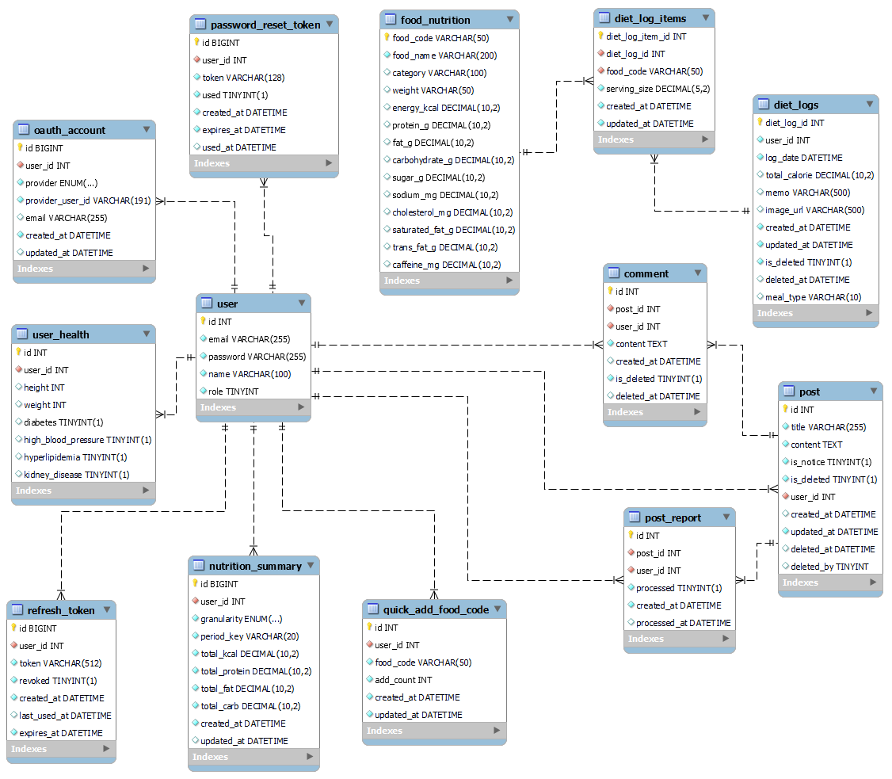
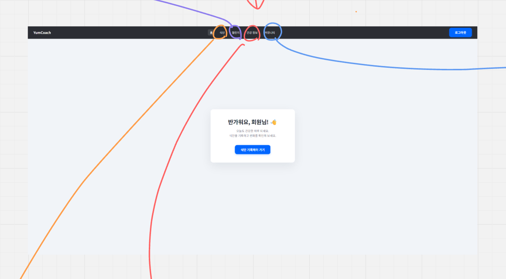
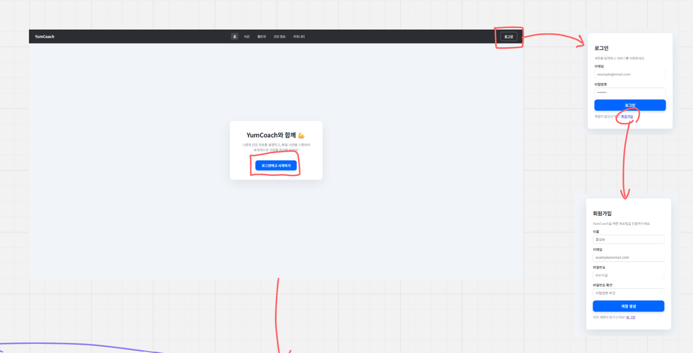
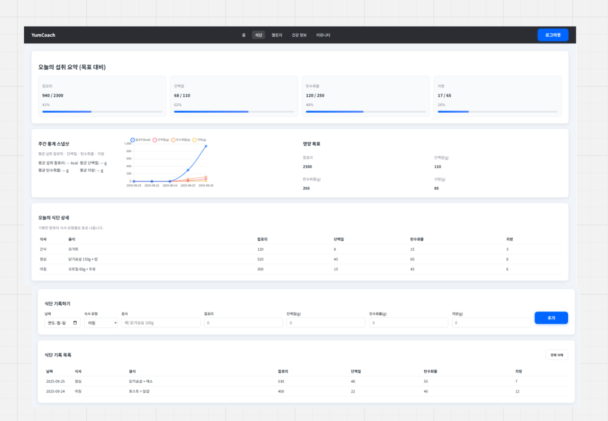
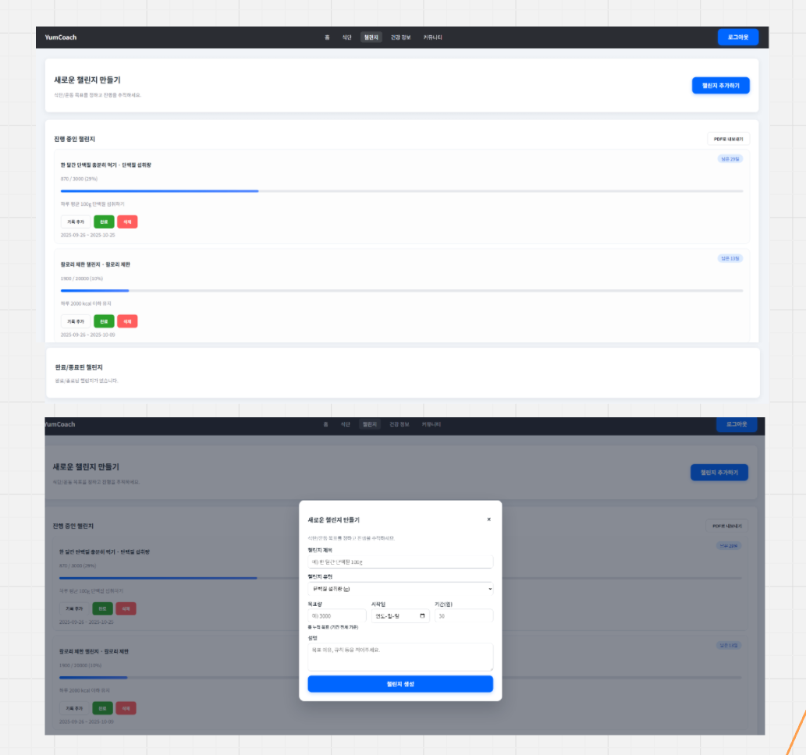
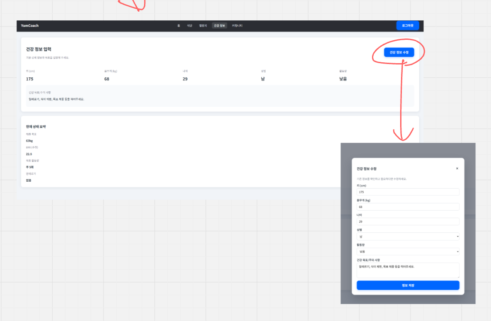

# :rocket: 요구사항 정의/API 명세

| 분류  | 요구사항명         | 요구사항 상세                                      | 우선순위 | End-point (HTTP)                                                                 |                |
| --- | ------------- | -------------------------------------------- | ---- | -------------------------------------------------------------------------------- | -------------- |
| 식단  | 식단 작성         | 섭취한 음식을 DB에 선택하여 식단기록을 작성                    | 5    | POST /api/meals                                                                  | 모든 삭제는 소프트 딜리트 |
| 식단  | 식단 조회         | 식단 ID를 활용하여 식단 기록 내용을 조회                     | 5    | GET /api/meals/{mealId}                                                          |                |
| 식단  | 식단 디테일 조회     | 식단 ID를 활용하여 식단 기록의 상세 내용을 조회                 | 5    | GET /api/meals/{mealId}/items                                                    |                |
| 식단  | 식단 수정         | 작성한 식단기록의 내용을 수정                             | 5    | PATCH /api/meals/{mealId}                                                        |                |
| 식단  | 항목 추가/삭제      | 특정 식단에 음식 항목 추가/삭제                           | 5    | POST /api/meals/{mealId}/items, DELETE /api/meals/{mealId}/items/{itemId}        |                |
| 식단  | 식단 삭제         | 작성한 식단 기록 삭제(소프트 딜리트 권장)                     | 5    | DELETE /api/meals/{mealId}                                                       |                |
| 식단  | 오늘 식단 리스트     | 사용자의 특정 일자별 식단 목록과 합계                        | 5    | GET /api/meals?date=YYYY-MM-DD                                                   |                |
| 식단  | 최근 자주 먹은 음식   | 최근 N개/자주 먹는 음식 추천(빠른 추가)                     | 3    | GET /api/foods/frequent?limit=20                                                 |                |
| 식단  | 음식 검색         | 이름/카테고리/영양기준으로 검색(페이지네이션)                    | 5    | GET /api/foods/search?q=&page=&size=                                             |                |
| 식단  | 커스텀 음식 등록     | DB에 없는 사용자의 커스텀 음식 저장                        | 3    | POST /api/foods/custom, GET /api/foods/custom, PATCH /api/foods/custom/{id}      |                |
| 식단  | 식단 복사/템플릿     | 과거 식단 복제 또는 템플릿 저장/적용                        | 3    | POST /api/meals/{mealId}/duplicates, POST /api/meals/templates                   |                |
| 식단  | 주/월간 리포트      | 주/월 합계, 평균, 추세 그래프용 데이터 PDF로 다운받을 수 있게       | 2    | GET /api/analytics/weekly?week=YYYY-WW, GET /api/analytics/monthly?month=YYYY-MM |                |
| 회원  | 회원가입          | 이메일 중복 검사, 비밀번호 정책, 이름                       | 5    | POST /api/auth/signup, GET /api/auth/email/check?email=                          |                |
| 회원  | 로그인/로그아웃      | 액세스/리프레시 토큰 발급·갱신·파기                         | 5    | POST /api/auth/signin, POST /api/auth/token/refresh, POST /api/auth/signout      |                |
| 회원  | 내 정보 조회/수정    | 프로필 이미지, 닉네임, 비밀번호                           | 5    | GET /api/users/me, PATCH /api/users/me                                           |                |
| 회원  | 건강 프로필        | 키/몸무게/BMI/질환(당뇨/고혈압 등)                       | 5    | GET /api/users/me/health, PATCH /api/users/me/health                             |                |
| 회원  | OAuth         | 구글/카카오 등 소셜 로그인                              | 4    | POST /api/auth/oauth/{provider}                                                  |                |
| 회원  | 이메일 인증/재발송    | OAuth 아닐 경우. 회원가입/비밀번호 찾기용 메일 인증             | 5    | POST /api/auth/verify/email   POST /api/auth/password/forgot                  |                |
| 회원  | 건강 프로필        | 키/몸무게/BMI/질환 등 정보 등록                         | 5    | GET/PATCH /api/users/me/health                                                   |                |
| 회원  | 알림 설정         | 푸시/이메일 알림(식사 리마인드, 리포트)                      | 3    | GET/PATCH /api/users/me/notifications                                            |                |
| 회원  | 세션/보안         | 최근 로그인 기기, 세션 종료                             | 1    | GET /api/users/me/sessions, DELETE /api/users/me/sessions/{sessionId}            |                |
| 운영  | 공지사항 목록 조회    | 모든 공지사항을 검색/페이지네이션으로 조회                      | 4    | GET /api/admin/notices                                                           |                |
| 운영  | 공지사항 등록       | 새 공지사항 생성                                    | 4    | POST /api/admin/notices                                                          |                |
| 운영  | 공지사항 상세 조회    | 특정 공지사항 단건 조회                                | 4    | GET /api/admin/notices/{id}                                                      |                |
| 운영  | 공지사항 수정       | 제목/내용/공개여부 등 수정                              | 4    | PATCH /api/admin/notices/{id}                                                    |                |
| 운영  | 공지사항 삭제       | 공지사항 삭제 (소프트 삭제 권장)                          | 4    | DELETE /api/admin/notices/{id}                                                   |                |
| 운영  | 유저 목록 조회      | 전체 사용자 목록 및 검색(이메일, 상태 등)                    | 4    | GET /api/admin/users                                                             |                |
| 운영  | 유저 상세 조회      | 특정 사용자의 상세 정보                                | 4    | GET /api/admin/users/{userId}                                                    |                |
| 운영  | 유저 상태/권한 수정   | 계정 비활성화, 관리자 권한 변경 등                         | 3    | PATCH /api/admin/users/{userId}                                                  |                |
| 운영  | 유저 삭제         | 사용자 계정 삭제(또는 비활성화 처리)                        | 3    | DELETE /api/admin/users/{userId}                                                 |                |
| 운영  | 신고 목록 조회      | 신고된 게시글/댓글 조회                                | 3    | GET /api/admin/reports                                                           |                |
| 운영  | 신고 처리         | 신고 승인/거절/조치 상태 변경                            | 3    | PATCH /api/admin/reports/{reportId}                                              |                |
| 운영  | 게시글 삭제        | 특정 게시글 삭제(신고된 글 포함)                          | 3    | DELETE /api/admin/posts/{postId}                                                 |                |
| 운영  | 댓글 삭제         | 특정 댓글 삭제                                     | 3    | DELETE /api/admin/comments/{commentId}                                           |                |
| AI  | 대체 음식 추천      | 과다/부족 영양소 기준으로 대체안 추천                        | 3    | POST /api/ai/substitute                                                          |                |
| AI  | 맞춤 코치(챗봇)     | 식단 피드백/목표 코칭/Q&A                             | 4    | POST /api/ai/coach:chat                                                          |                |
| AI  | 이상 탐지         | 갑작스런 과식/영양 불균형 패턴 감지                         | 3    | GET /api/ai/anomalies?range=...                                                  |                |
| AI  | 식단 이미지로 자동 입력 | 사용자가 이미지를 업로드 하면 AI로 해당 식단의 음식 목록 및 중량(g) 측정 | 3    | POST /api/ai/meal-images                                                         |                |

---
# :newspaper: Gant 차트

## 전체 일정

### 식단 관련

### 회원 관련

### 운영 관련

### AI 관련련

---

# :ledger: WBS
### 전체 일정

| WBS 코드 | 작업명             | 설명                     | 담당       | 산출물                             | 완료 기준                        | 예상 기간 (일) |
| ------ | --------------- | ---------------------- | -------- | ------------------------------- | ---------------------------- | --------- |
| 1-1    | 요구사항 정의         | 프로젝트 요구사항 및 주요 기능 정의   | KIM / YU | 요구사항 정의서(PRD), 기능 목록표           | 요구사항 명세 문서 작성 및 팀 내부 검토 완료   | 2         |
| 1-2    | API 명세서 초안      | 주요 API 정의              | KIM / YU | API 명세서(v1), 엔드포인트 리스트          | 핵심 API 구조 정의 및 리뷰 승인         | 4         |
| 1-3    | 아키텍처 설계         | 백엔드/프론트/AI/DB 전체 구조 설계 | KIM / YU | 시스템 아키텍처 다이어그램, 모듈 구조도          | 전체 시스템 구조 문서화, 기술 스택 확정      | 4         |
| 1-4    | ERD / DB 설계     | 전체 데이터 스키마 설계          | KIM / YU | ERD, 테이블 정의서                    | 모든 테이블/관계 정의 완료 및 팀 검토 통과    | 4         |
| 1-5    | UI/UX 설계        | 와이어프레임, 사용자 흐름 정의      | KIM / YU | 와이어프레임, 사용자 플로우 차트              | 핵심 화면 구성 완료, 사용자 흐름 명확화      | 4         |
| 2-1    | 개발 환경 구축        | 개발 환경 통일 및 컨벤션 정리      | KIM / YU | 프로젝트 구조, 코드 컨벤션 정리              | 환경 동일화 완료 및 모든 팀원이 실행 성공     | 4         |
| 2-2    | 도메인 설계          | 도메인 모델 정의, 엔티티 설계      | KIM / YU | 도메인 모델링 문서, 엔티티 정의서             | 주요 도메인 + 엔티티 확정, 개발 가능 상태    | 3         |
| 2-3    | 도메인 개발          | 핵심 비즈니스 로직 개발          | KIM / YU | 도메인 서비스 코드, 유닛 테스트              | 도메인 기능 정상 동작 및 테스트 통과        | 7         |
| 3-1    | AI 이미지 분석 모델 개발 | 이미지 → 음식 검출/분류 모델 구현   | KIM      | AI 모델(v1), Inference 코드, 평가 리포트 | 기본 이미지 분석 정확도 확보(내부 기준 충족)   | 15        |
| 3-2    | AI 챗봇 모델 개발     | 식단 코칭/조언 모델 구현         | YU       | 챗봇 모델(v1), 프롬프트 세트, 응답 시나리오     | 챗봇이 주요 질문/답변 1차 수행 가능        | 10        |
| 4-1    | UI 개발           | FE 기본 화면 개발            | KIM      | 핵심 화면 UI, 라우팅 구성                | UI 주요 기능 흐름 완료, API 연동 가능 상태 | 15        |
| 4-2    | API 상세 설계       | 백엔드 상세 기능/에러/유효성 설계    | KIM / YU | API 스펙(v2), 에러 코드 정의서           | 모든 API 상세 스펙 확정 및 개발 ready   | 5         |
| 4-3    | 문서화             | 개발 문서/Swagger/사용 가이드   | KIM / YU | Swagger 문서, README, 사용 가이드      | 문서 공개형태 완성 & 팀원 확인 완료        | 3         |

### 식단 관련

| WBS 코드 | 작업명        | 설명                   | 담당  | 산출물            | 완료 기준                   | 예상 기간 (일) |
| ------ | ---------- | -------------------- | --- | -------------- | ----------------------- | --------- |
| F1     | 식단 작성      | 식단 생성 API 구현         | KIM | 식단 작성 API      | POST 요청으로 식단 생성 성공      | 3         |
| F2     | 식단 조회      | 단일 식단 조회 API         | KIM | 식단 조회 API      | 식단 ID 기반 조회 기능 정상 동작    | 3         |
| F3     | 식단 상세 조회   | 식단 항목 조회 API         | KIM | 식단 상세 API      | 식단 내 음식 항목 리스트 반환       | 3         |
| F4     | 식단 수정      | 식단 레코드 수정            | KIM | 식단 수정 API      | 수정 요청 시 변경사항 DB 반영      | 3         |
| F5     | 항목 추가/삭제   | 음식 항목 CRUD           | KIM | 항목 추가/삭제 API   | 항목 추가/삭제 정상 동작 및 반영     | 3         |
| F6     | 날짜별 리스트    | 특정 날짜 식단 전체 조회       | KIM | 날짜별 리스트 API    | 날짜 입력 시 모든 식단 리스트 반환    | 2         |
| F7     | 음식 검색      | 음식 목록 검색             | KIM | 검색 API         | 키워드 검색 시 페이징 포함 정상 작동   | 3         |
| F8     | 자주 먹는 음식   | 추천 기능                | KIM | 빈도 기반 추천 API   | 최근 데이터 기반 추천값 정확 반환     | 2         |
| F9     | 커스텀 음식     | 사용자 입력 데이터 저장        | KIM | 커스텀 음식 API     | 사용자 정의 음식 등록 성공         | 2         |
| F10    | 식단 복사/템플릿  | 과거 식단 복제             | KIM | 식단 복사 API      | 기존 식단 ID로 복사 생성 가능      | 2         |
| F11    | 주/월 리포트    | 영양 분석                | KIM | 리포트 데이터 API    | 주간/월간 통계 정상 반환          | 3         |

### 회원 관련

| WBS 코드 | 작업명        | 설명               | 담당  | 산출물           | 완료 기준                   | 예상 기간 (일) |
| ------ | ---------- | ---------------- | --- | ------------- | ----------------------- | --------- |
| U1     | 회원가입       | 이메일/비밀번호/기본정보 등록 | YU  | 회원가입 API      | 회원 DB 삽입 정상 동작          | 2         |
| U2     | 이메일 체크     | unique 여부 확인     | YU  | 중복확인 API      | 중복 이메일 시 오류 반환          | 1         |
| U3     | 로그인/로그아웃   | JWT 인증/로그아웃 처리   | YU  | 로그인/로그아웃 API  | 로그인 성공 및 토큰 발급          | 3         |
| U4     | 토큰 재발급     | refresh 토큰 기능    | YU  | 재발급 API       | 유효한 refresh로 access 재발급 | 2         |
| U5     | 내 정보 조회/수정 | 프로필 관리           | YU  | 내 정보 API      | 조회/수정 모두 정상 수행          | 3         |
| U6     | 건강 프로필     | 질환/BMI 정보 관리     | YU  | 건강 프로필 API    | 건강 정보 CRUD 정상 작동        | 3         |
| U7     | OAuth      | 소셜 로그인 연동        | YU  | OAuth 로그인 API | 구글/카카오 성공 로그인           | 4         |
| U8     | 이메일 인증     | 인증 메일/비밀번호 찾기    | YU  | 인증 메일 API     | 메일 발송 및 인증 성공 처리        | 3         |
| U9     | 세션 관리      | 기기/세션 종료         | YU  | 세션 관리 API     | 현재 로그인 기기 목록/종료 정상 동작   | 2         |

### 운영 관련

| WBS 코드 | 작업명       | 설명             | 담당  | 산출물          | 완료 기준             | 예상 기간 (일) |
| ------ | --------- | -------------- | --- | ------------ | ----------------- | --------- |
| A1     | 공지 CRUD   | 공지 생성/조회/수정/삭제 | YU  | 공지 API       | CRUD 정상 동작        | 3         |
| A2     | 유저 목록/상세  | 유저 데이터 관리      | YU  | 유저 목록/상세 API | 검색·필터·단건 조회 정상 동작 | 3         |
| A3     | 유저 수정/삭제  | 계정 제어          | YU  | 유저 수정/삭제 API | 유저 권한/상태 변경 성공    | 3         |
| A4     | 신고 처리     | 게시글/댓글 신고 관리   | YU  | 신고 처리 API    | 신고 상태값 업데이트 정상 반영 | 3         |
| A5     | 게시글/댓글 삭제 | 관리자 삭제         | YU  | 삭제 API       | 관리자 권한 삭제 정상 작동   | 2         |

### AI 관련

| WBS 코드 | 작업명    | 설명                   | 담당  | 산출물            | 완료 기준                | 예상 기간 (일) |
| ------ | ------ | -------------------- | --- | -------------- | -------------------- | --------- |
| AI1    | 이미지 분석 | 식단 이미지 → 음식/중량 분석    | KIM | 모델(v1), 분석 API | 이미지 입력 시 음식/중량 분석 성공 | 8         |
| AI2    | 챗봇     | 식단 코칭 대화 모델          | YU  | 챗봇 모델(v1)      | 기본 질문/답변 시나리오 응답 성공  | 7         |
| AI3    | 이상 탐지  | 영양 anomaly detection | KIM | 패턴 분석 로직       | 특이 패턴 감지해 응답 생성      | 7         |
|AI4|대체 음식 추천|부족 영양 → 추천|KIM|추천 알고리즘|영양 부족 시 대체 음식 추천 정상 출력|4|

---
# :books: ERD/DB

### user
유저 테이블
- 역할
	- 1: 일반 사용자
	- 2: 관리자
- `id` INT (AUTO_INCREMENT, PK)
- `email` VARCHAR(255)
- `password` VARCHAR(255)
- `name` VARCHAR(100)
- `role` TINYINT

### user_health
유저 건강 정보 테이블
- `id` INT (AUTO_INCREMENT, PK)
- `user_id` INT
- `height` INT
- `weight` INT
- `diabetes` BOOLEAN / TINYINT(1)
- `high_blood_pressure` BOOLEAN / TINYINT(1)
- `hyperlipidemia` BOOLEAN / TINYINT(1)
- `kidney_disease` BOOLEAN / TINYINT(1)  

### oauth_account
OAuth 관련 테이블
- `id` BIGINT (PK)
- `user_id` INT
- `provider` ENUM(...)
- `provider_user_id` VARCHAR(191)
- `email` VARCHAR(255)
- `created_at` DATETIME
- `updated_at` DATETIME  

### refresh_token
JWT refresh token 테이블
- `id` BIGINT (AUTO_INCREMENT, PK)
- `user_id` INT
- `token` VARCHAR(512)
- `revoked` TINYINT(1)
- `created_at` DATETIME
- `last_used_at` DATETIME
- `expires_at` DATETIME

### password_reset_token
Password reset token 테이블
- `id` BIGINT
- `user_id` INT
- `token` VARCHAR(128)
- `used` TINYINT(1)
- `created_at` DATETIME
- `expires_at` DATETIME
- `used_at` DATETIME  

### nutrition_summary
일간, 주간, 월간 요약 리포트 테이블
- granularity
	- 일간, 주간, 월간 (집계 단위)
- period_key
	- 해당 기간의 키 문자열
		- DAILY: `'2025-11-12'`
		- WEEKLY: `'2025-W46'` (ISO-8601 주차 권장)
		- MONTHLY: `'2025-11'`
- `id` BIGINT (PK)
- `user_id` INT
- `granularity` ENUM(...)
- `period_key` VARCHAR(20)
- `total_kcal` DECIMAL(10,2)
- `total_protein` DECIMAL(10,2)
- `total_fat` DECIMAL(10,2)
- `total_carb` DECIMAL(10,2)
- `created_at` DATETIME
- `updated_at` DATETIME  

### quick_add_food_code
자주 추가하는 음식을 빨리 추가하기 위한 테이블
- `id` INT (AUTO_INCREMENT, PK)
- `user_id` INT
- `food_code` VARCHAR(50)
- `add_count` INT
- `created_at` DATETIME
- `updated_at` DATETIME  

### food_nutrition
음식 영양 정보 테이블
- `food_code` VARCHAR(50)
- `food_name` VARCHAR(200)
- `category` VARCHAR(100)
- `weight` VARCHAR(50)
- `energy_kcal` DECIMAL(10,2)
- `protein_g` DECIMAL(10,2)
- `fat_g` DECIMAL(10,2)
- `carbohydrate_g` DECIMAL(10,2)
- `sugar_g` DECIMAL(10,2)
- `sodium_mg` DECIMAL(10,2)
- `cholesterol_mg` DECIMAL(10,2)
- `saturated_fat_g` DECIMAL(10,2)
- `trans_fat_g` DECIMAL(10,2)
- `caffeine_mg` DECIMAL(10,2)

### diet_log_items
각 끼니에 대한 정보 테이블
- meal_type
	- 아침, 점심, 저녁
- `diet_log_item_id` INT (AUTO_INCREMENT, PK)
- `diet_log_id` INT
- `food_code` VARCHAR(50)
- `serving_size` DECIMAL(5,2)
- `created_at` DATETIME
- `updated_at` DATETIME  

### diet_logs
하루치 식사에 대한 정보 테이블
- `diet_log_id` INT (AUTO_INCREMENT, PK)
- `user_id` INT
- `log_date` DATETIME
- `total_calorie` DECIMAL(10,2)
- `memo` VARCHAR(500)
- `image_url` VARCHAR(500)
- `created_at` DATETIME
- `updated_at` DATETIME
- `is_deleted` TINYINT(1)
- `deleted_at` DATETIME
- `meal_type` VARCHAR(10) 

### comment
댓글 정보 테이블
- `id` INT (AUTO_INCREMENT, PK)
- `post_id` INT
- `user_id` INT
- `content` TEXT
- `created_at` DATETIME
- `is_deleted` TINYINT(1)
- `deleted_at` DATETIME

### post
게시글 정보 테이블
- `id` INT (AUTO_INCREMENT, PK)
- `title` VARCHAR(255)
- `content` TEXT
- `is_notice` TINYINT(1) ← (사진에 보이는 컬럼)
- `is_deleted` TINYINT(1) ← (사진에 보이는 컬럼)
- `user_id` INT
- `created_at` DATETIME
- `updated_at` DATETIME
- `deleted_at` DATETIME
- `deleted_by` TINYINT

### post_report
게시글 신고 정보 테이블
- `id` INT (AUTO_INCREMENT, PK)
- `post_id` INT
- `user_id` INT
- `processed` TINYINT(1)
- `created_at` DATETIME
- `processed_at` DATETIME  

---

# :runner: 유스케이스 다이어그램

---

# UI/UX

메인화면

회원가입/로그인

식단 관리

챌린지

건강 정보 관리

커뮤니티
